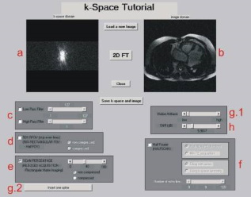
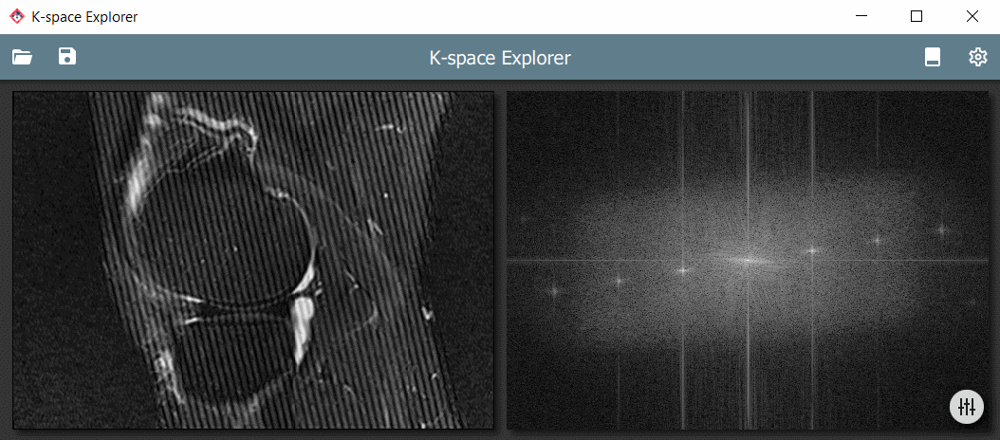

# K-space Explorer

**An educational tool to get hands-on experience with the k-space and the
effects of various modifications on the resulting image after an inverse
Fourier transform.**


K-space Explorer is written in Python 3 and uses open source libraries so
it can be used for free and the source code can be inspected to peek under
the hood.

The software has many useful features, such as:

* A modern responsive user interface using Qt
* Real-time Fourier transform to instantaneously visualise changes
* Load your own images and analyse artefacts originating from kspace
* Short explanation for various functions within the software

---

☕ **This app was created in my spare time.**
If you find it useful please consider [buying me a coffee with PayPal](https://www.paypal.me/birogeri/5gbp) ☕

---

## **Installation**

1. You will need to have the following software and packages

    * **Python 3** (ideally the latest version). Download from the [Python 3 homepage](https://www.python.org/downloads).

2. Required Packages for Python 3:

    * **PyQt5**     - provides graphical user interface
    * **Pillow**    - opens regular images such as jpg or png
    * **NumPy**     - handles FFT transforms and array operations
    * **pydicom**   - DICOM format medical image reader

    Install via pip by copying the command below to a command prompt (Windows: `Win+R` and type `cmd` and hit Enter)

    ```shell
        pip3 install numpy pydicom Pillow PyQt5
    ```

3. [Download the app](https://github.com/birogeri/kspace-explorer/archive/master.zip) and extract it

## Starting the program

Navigate to the folder that contains and run it by typing the command below

``` shell
    python3 kspace.py
```

**Alternatively (on Windows)**

To save you navigating on Windows, 
just open the folder where the app was extracted and: 
* Click the address bar (the line that looks something 
like this: *"This PC > Downloads > kspace-explorer-master"*)
* Delete the address and type ```cmd``` and hit Enter
* A window should appear and you can now type ```python3 kspace.py```
## **Usage**

KSE automatically loads a default image but you can
easily switch images by either:

* Clicking Open New Image  on the toolbar
* Pressing `Ctrl+O`
* Simply by drag and dropping a file or files

### Accessing the k-space modifiers

There are various modifiers available to modify the k-space to see their effects on the resulting image. These are accessible from the drawer panel on the right. To access it:

* Click and Drag inwards from the right side of the window
* Hit the `Tab` key
* Click the round button  on the lower right side

### Simulating image acquisition

You can use the controls in the footer. The footer can be toggled by using the toolbar icon  or by hitting `F7`

* To start or continue the acquisition, press Play/Pause  or hit `F5`
* To rewind press Rewind  or hit ``F4``
* You can change the simulation mode with the combobox on right-hand side

### Saving images

Your modified images can be saved to your computer by either

* Pressing `Ctrl+S`
* Clicking Save  on the toolbar

Then select the location and the filename. Visual representation of the k-space and the corresponding image will be saved with *_k* and *_i* suffixes respectively.

*Please note that if you select the tiff format, k-space image will be saved with 32-bit depth. This not handled well with many image viewers.*

### Brightness/contrast and windowing

To enhance certain parts of the image for viewing it is often useful to change the **brightness** or **contrast** of the displays.

* Hold the right mouse button and move up/down to change image or k-space brighness
* Hold the right mouse button and move left/right to change image contrast

With **windowing** it is possible to limit the displayed image pixel intensity range.

* Drag mouse left/right with middle mouse button pressed to change window width
* Drag mouse up/down with middle mouse button pressed to change window center

## **Comparison to Other Similar Projects**

This app was directly influenced by the article of D. Moratal et al. [1], however my aim was to go beyond the functionality that it offers. There are several other similar software for different computing environments. Here is a non exhaustive list of them:

* [k-Space Tutorial](https://www.ncbi.nlm.nih.gov/pmc/articles/PMC3097694/) (PC, Matlab) [1]
* [Journey through k-space](http://ww3.comsats.edu.pk/miprg/Downloads.aspx) (PC, Matlab) [2]
* [A k-Space Odyssey](https://www.kspace.info/) (iOS) [3]
* [K-Spapp](https://mrapps.jouwweb.nl/) (Android, free) [4]

|  |
|:--:|
|*A screenshot from k-Space Tutorial by D. Moratal et al.*|

### Software Requirements

 Matlab is a requirement for many similar apps. Matlab is proprietary software and can be costly to purchase a license.
 K-space Explorer only uses free software to make it more accessible.

### User Interface

The aim of K-space Explorer is to provide a smooth, modern UI with familiar tools and instant response whenever possible. Updates happen real time so immediate feedback is given for the effect of the changes.

|  |
|:--:|
| *A real-life herringbone artefact and the corresponding k-space* |

### Free and Open Source

To get a deeper understanding of the inner workings the code can be inspected. In-line documentation can help understanding the mathematical principles behind various interactions.

## Known bugs

* RGB DICOMs are not supported

## Planned features

* Heal Tool - remove spikes from kspace
* Accelerated scanning method simulation (SENSE, GRAPPA, POCS)
* Multiple languages
* CLAHE enhanchement

## Disclaimer and limitations

This software is not intended for medical use.
Even if a scanner original DICOM file is used, the resulting k-space is not equivalent
to the scanner raw data as it contains all post-acquisition modifications
applied by the scanner software.

## Author & Contributors

|  |
|:--:|
| [Gergely Biró](https://www.linkedin.com/in/gergelybiro) |


## References

```references
    [1] Moratal, D., Vallés-Luch, A., Martí-Bonmati, L., & Brummers, M. E. (2008). k-Space tutorial: An MRI educational tool for a better understanding of k-space. Biomedical Imaging and Intervention Journal, 4(1). http://doi.org/10.2349/biij.4.1.e15

    [2] Qureshi, M., Kaleem, M., & Omer, H. (2017). Journey through k-space: An interactive educational tool. Biomedical Research (India), 28(4), 1618–1623.

    [3] Ridley, E. L. (21/03/2017). Mobile App Spotlight: A k-Space Odyssey. Source: AuntMinnie.com: https://www.auntminnie.com/index.aspx?sec=sup&sub=mri&pag=dis&ItemID=116900&wf=7612

    [4] K-Spapp - https://mrapps.jouwweb.nl/
```
